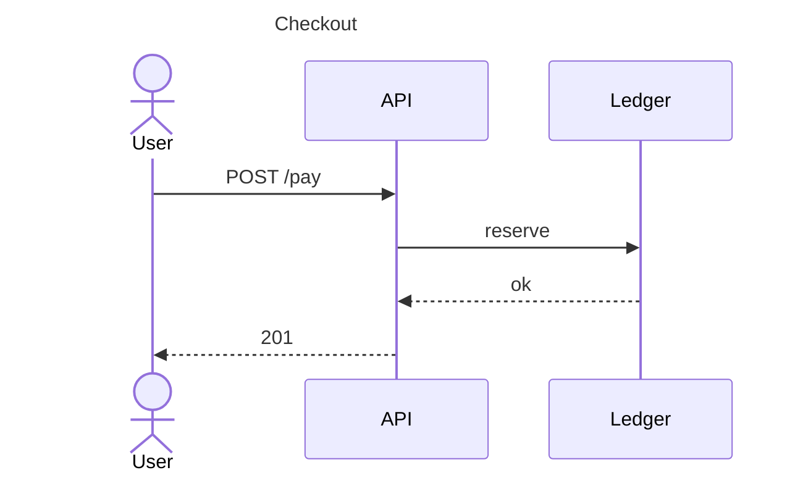

# DiagramTool

Local-first text-to-diagram workspace for **architecture**, **flow**, **sequence**, and **Gantt**. Write a small native DSL, paste Mermaid, or open a draw.io file — the canvas updates in the browser. Boards stay on this device (IndexedDB workspace, optional File → Open / Save).

**Live demo:** [https://diagram-tool.teqcon.uk/](https://diagram-tool.teqcon.uk/) (marketing) · [workspace](https://diagram-tool.teqcon.uk/app/)

This is a Vite + React + TypeScript app.

| Route | What loads |
|-------|------------|
| `/` | Marketing landing + waitlist. Cold HTML. Does **not** boot the Local workspace for first-time visitors. |
| `/app` | Existing Local workspace (Home / boards / editor). |
| `/api/waitlist` | Same-origin waitlist API (Vite preview/dev middleware). Persists email + optional note + UTMs to JSONL. |
| `/pricing` | Out of scope. |

`npm run build` ships `dist/` (landing `index.html`, workspace `app/index.html`, and everything in `public/`). The older mock under `landing/` is unused.

### Analytics env (optional)

The landing never blocks if these are missing — it uses safe no-op stubs.

| Variable | Purpose |
|----------|---------|
| `VITE_POSTHOG_KEY` | Preferred. Enables pageview on `/`, `waitlist_submit_success`, and `cta_open_app_click`. |
| `VITE_POSTHOG_HOST` | Optional. Defaults to `https://us.i.posthog.com`. |
| `VITE_GA4_MEASUREMENT_ID` | Used only when the PostHog key is unset. |
| `WAITLIST_FILE` | Server-side JSONL path for signups. Defaults to `./data/waitlist.jsonl` on the preview/dev host. |

See `.env.example`. Production deploy must pass the `VITE_*` vars at **build** time for analytics to fire.

## What it does

| Mode | Source | Typical use |
|------|--------|-------------|
| **Architecture** | Native `diagram: architecture` DSL | Services, databases, queues, cloud kinds, C4 levels, groups |
| **Flow** | Native `diagram: flow` DSL, or Mermaid `flowchart` / `graph` | Process maps, BPMN-style shapes, swimlanes |
| **Sequence** | Mermaid `sequenceDiagram` | Request/response and participant timelines |
| **Gantt** | Native `diagram: gantt` DSL | Tasks, groups, dependencies, milestones |

**Also supported**

- **File → Open** accepts portable board JSON, native DSL, Mermaid (`.mmd` / `.mermaid`), and draw.io / diagrams.net (`.drawio` / `.xml`). Draw.io imports as a **flow** board (best-effort; swimlanes, extra pages, and unclassified stencils are skipped).
- Mermaid `gantt` files convert to native `diagram: gantt` on open. The Gantt **editor** stays native-DSL-only.
- Mermaid types such as `erDiagram`, `classDiagram`, `mindmap`, and C4 Mermaid are not opened.
- Export PNG, SVG, PDF, JSON backup, and CSV. CSV **import** can build a service map from APM-style rows (Datadog / Jaeger / OpenTelemetry-style columns).
- Templates for AWS, Kubernetes, GCP, C4, ER, UML class, flows, BPMN, swimlanes, and Gantt starters.
- Optional local MCP server (`mcp/` / `mcp-server/`) so an editor can author boards over stdio — nothing is sent to a DiagramTool cloud.

There are no product screenshots in this repository yet. Use the [live demo](https://diagram-tool.teqcon.uk/) or `npm run dev` to see the workspace.

## Install and quick start

Requires Node.js 22 (the production workflow uses Node 22).

```bash
npm install
npm run dev
```

Open the printed local URL. Pick **Architecture**, **Flow**, **Sequence**, or **Gantt**, type or paste source on the left, and watch the canvas on the right.

```bash
npm test          # unit tests (Vitest)
npm run build     # production bundle → dist/
npm run preview   # serve dist/ locally
```

DSL reference: [USAGE.md](USAGE.md). Portable board JSON: [docs/board-format.md](docs/board-format.md).

## Feature bullets

- Local-first workspace (IndexedDB) plus File → Open / Save on this device
- Architecture DSL: `service`, `database`, `queue`, `cloud`, `class`, `group`, C4 `level` / `parent`
- Flow DSL: process, decision, data, document, BPMN gateways/events/subprocesses, swimlanes
- Sequence: Mermaid `sequenceDiagram` as the source of truth
- Gantt: native plan DSL (groups, dates, assignees, FS/SS/FF/SF dependencies)
- Mermaid flow import/export helpers; Mermaid gantt import via File → Open
- draw.io import → flow board, sanitized locally (no remote fetch of the file)
- White canvas so PNG/SVG/PDF pastes cleanly into docs and slides
- Keyboard: `Ctrl/Cmd+S` save, `Ctrl/Cmd+Z` undo, click-to-drill C4, wheel/pinch zoom

## Examples

### Architecture (native DSL)

```
diagram: architecture
title: Checkout platform
direction: horizontal
edges: orthogonal

service CheckoutAPI {
  type: api
  tech: Node.js
  connects: OrdersDB, EventBus
}

database OrdersDB {
  type: postgresql
  data: orders, payments
}

queue EventBus {
  type: kafka
  topic: checkout.events
}
```

### Flow (native DSL)

```
diagram: flow
title: Refund decision

start Request
node Eligible {
  type: decision
  label: Within policy?
}
node Refund { label: Issue refund }
node Escalate { label: Manual review }
end Done

Request -> Eligible
Eligible ->|yes| Refund -> Done
Eligible ->|no| Escalate -> Done
```

### Sequence (Mermaid)



### Gantt (native DSL)

```
diagram: gantt
title: Launch plan
start: 2026-09-01

group "Build" {
  task Design {
    start: 2026-09-01
    end: 2026-09-05
    assignee: Design
  }
  task Implement {
    start: 2026-09-05
    end: 2026-09-12
    depends: Design
  }
}
```

GitHub will also render the sequence example above as a diagram. In the app, paste that `sequenceDiagram` block on the **Sequence** tab.

## Crawlable pages

Static HTML (copied from `public/` into `dist/` on build):

- [Architecture from text](https://diagram-tool.teqcon.uk/architecture-diagram-from-text.html)
- [Flowcharts from text](https://diagram-tool.teqcon.uk/flowchart-from-text.html)
- [Sequence diagrams](https://diagram-tool.teqcon.uk/sequence-diagram-from-text.html)
- [Mermaid and Gantt](https://diagram-tool.teqcon.uk/mermaid-gantt-diagram.html)
- [Local-first workspace and draw.io](https://diagram-tool.teqcon.uk/local-first-diagram-workspace.html)

`robots.txt` and `sitemap.xml` live in `public/` so they ship as real files, not the SPA HTML shell.

## Development

```
diagram-tool/
├── index.html     # Marketing landing (cold HTML)
├── app/index.html # Local workspace SPA entry
├── src/           # React app, parser, canvas, Gantt, sequence, landing JS
├── vite-plugins/  # Waitlist API + /app fallback for dev/preview
├── public/        # Static assets copied to dist/ (SEO HTML, robots, sitemap)
├── docs/          # Board format and MCP notes
├── e2e/           # Playwright
├── mcp/           # Local stdio MCP
├── landing/       # Unused by production deploy
└── USAGE.md       # DSL manual
```

Internal sprint notes under `memory/` are historical and are not the product docs.

## License

MIT (as stated for this project; there is no separate `LICENSE` file in the tree today).
